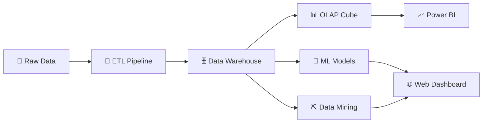
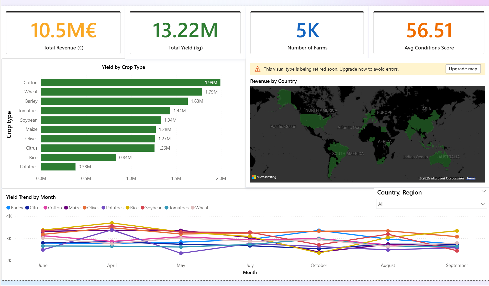

# Urban Farming Optimization System

<p align="center">
  
  
  
  
  
</p>

<p align="center">
  <strong>A comprehensive data mining and machine learning platform for optimizing urban farming operations.</strong>
</p>

---

## Table of Contents

- [Overview](#overview)
- [Features](#features)
- [Architecture](#architecture)
- [Project Structure](#project-structure)
- [Installation](#installation)
- [Usage](#usage)
- [Machine Learning Models](#machine-learning-models)
- [Data Mining](#data-mining)
- [Web Application](#web-application)
- [ETL Pipeline](#etl-pipeline)
- [Technologies](#technologies)
- [Screenshots](#screenshots)
- [Crop Types Supported](#crop-types-supported)
- [License](#license)

---

## Overview

Urban Farming Optimization System is an end-to-end data analytics platform designed to help urban farmers maximize crop yields while minimizing resource consumption. The system combines **ETL pipelines**, **data warehousing**, **machine learning**, and **data mining** techniques to provide actionable insights.

### Key Metrics

| Metric | Value |
|--------|-------|
| 📊 Total Records | 4,500+ |
| 🌱 Crop Types | 10 |
| 🗺️ Regions | 29 |
| 📈 Features | 34 |
| 🎯 ML Accuracy | 99.5% R² |

---

## Features

- **🔄 Automated ETL Pipeline** - Apache Airflow-orchestrated data ingestion and transformation
- **🗄️ Data Warehouse** - Star schema design optimized for OLAP analysis
- **🤖 Yield Prediction** - Gradient Boosting model achieving 99.5% R² accuracy
- **📊 Data Mining** - K-Means clustering and Apriori association rules
- **💧 Irrigation Optimization** - Linear programming for resource optimization
- **🌐 Interactive Dashboard** - Flask web application with Plotly visualizations
- **📦 OLAP Cube** - SQL Server Analysis Services (SSAS) for multidimensional analysis

---

##  Architecture



---

## Project Structure

```
urban-farming-analytics/
├── 📂 airflow/                    # Apache Airflow configuration
│   └── dags/                      # DAG definitions
│       └── urban_farming_etl_dag.py
├── 📂 data/                       # Data files
│   ├── farming_with_prices_extended.csv  # Main dataset
│   └── commodity_futures.csv
├── 📂 docs/                       # Documentation
│   └── data_warehouse_schema.md
├── 📂 models/                     # Trained ML models
│   └── yield_prediction_pipeline.pkl
├── 📂 reports/                    # Generated reports & visualizations
│   └── ml/
├── 📂 scripts/                    # Python scripts
│   ├── etl/                       # ETL pipeline scripts
│   ├── ml/                        # Machine learning training
│   ├── mining/                    # Data mining algorithms
│   └── optimization/              # Linear programming optimizers
├── 📂 ssas/                       # SSAS OLAP cube project
│   └── MDX_Queries.md
├── 📂 webapp/                     # Flask web application
│   ├── app.py                     # Main Flask app
│   ├── config.py                  # Configuration
│   ├── templates/                 # Jinja2 HTML templates
│   ├── static/                    # CSS, JS, images
│   └── utils/                     # Utility modules
└── requirements.txt               # Python dependencies
```

---

## Installation

### Prerequisites

- Python 3.10+
- SQL Server 2019+ (optional, for data warehouse)
- Docker (optional, for Airflow)

### Quick Setup

```bash
# Clone the repository
git clone https://github.com/yourusername/urban-farming-analytics.git
cd urban-farming-analytics

# Create virtual environment
python -m venv venv
source venv/bin/activate  # Linux/Mac
.\venv\Scripts\activate   # Windows

# Install dependencies
pip install -r requirements.txt
```

---

## Usage

### 1. Train Machine Learning Models

```bash
python scripts/ml/yield_prediction.py
```

This will:
- Load and preprocess the dataset
- Train multiple models (Linear Regression, Random Forest, Gradient Boosting)
- Save the best model to `models/yield_prediction_pipeline.pkl`
- Generate performance reports in `reports/ml/`

### 2. Run Data Mining

```bash
# Clustering analysis
python scripts/mining/clustering.py

# Association rule mining
python scripts/mining/association_rules.py
```

### 3. Launch Web Dashboard

```bash
python webapp/app.py
```

Open your browser at **http://127.0.0.1:5000**

### 4. Run ETL Pipeline (with Docker)

```bash
cd airflow
docker-compose up -d
```

Access Airflow UI at **http://localhost:8080**

---

## Machine Learning Models

### Model Comparison

| Model | R² Score | RMSE | Training Time |
|-------|----------|------|---------------|
| Linear Regression | 0.649 | 727 | < 1s |
| Random Forest | 0.994 | 91 | ~5s |
| **Gradient Boosting** ⭐ | **0.995** | **90** | ~8s |

### Best Model Performance

The **Gradient Boosting** regressor achieves exceptional performance:
- **R² Score**: 0.995 (99.5% variance explained)
- **RMSE**: 90 kg/hectare
- **Cross-validation**: 5-fold with consistent results

### Feature Importance

Top predictive features:
1. 🌡️ Temperature
2. 💧 Irrigation Amount
3. 🧪 Fertilizer Usage
4. ☀️ Sunlight Hours
5. 🌍 Soil Quality

---

## Data Mining

### Clustering (K-Means)

- Segments farms into distinct groups based on:
  - Growing conditions
  - Resource usage
  - Yield performance
- Optimal clusters: **4-5** (determined by elbow method)

### Association Rule Mining (Apriori)

Discovers patterns like:
- *High irrigation + optimal temperature → High yield*
- *Organic fertilizer + good soil → Premium quality*

---

## Web Application

### Available Pages

| Page | Route | Description |
|------|-------|-------------|
| 🏠 Home | `/` | Overview statistics and KPIs |
| 📊 Dashboard | `/dashboard` | Interactive charts and graphs |
| 🔮 Predictions | `/predictions` | ML-powered yield predictions |
| 📈 Analysis | `/analysis` | Data analysis tools |
| 🔍 Data Explorer | `/data-explorer` | Browse and filter records |
| ℹ️ About | `/about` | Project information |

### Key Features

- **Real-time Predictions**: Enter farm parameters to get instant yield predictions
- **Interactive Charts**: Plotly-powered visualizations
- **Data Exploration**: Filter and sort through 4,500+ records
- **Responsive Design**: Works on desktop and mobile

---

## ETL Pipeline

### Pipeline Architecture

The Apache Airflow DAG runs **daily at 6:00 AM** with the following tasks:

```
validate_source_data → process_data → retrain_models → log_pipeline_success
```

### Tasks Description

| Task | Description |
|------|-------------|
| `validate_source_data` | Validates data file integrity and schema |
| `process_data` | Transforms and enriches raw data |
| `retrain_models` | Updates ML models with latest data |
| `log_pipeline_success` | Logs execution metrics |

---

## Technologies

### Data Processing
- **Pandas** - Data manipulation
- **NumPy** - Numerical computing

### Machine Learning
- **Scikit-learn** - ML algorithms
- **XGBoost** - Gradient boosting
- **Joblib** - Model persistence

### Data Mining
- **MLxtend** - Association rules (Apriori)

### Visualization
- **Plotly** - Interactive charts
- **Matplotlib/Seaborn** - Static plots

### Web Framework
- **Flask** - Backend API and routing
- **Jinja2** - HTML templating

### Data Warehouse
- **SQL Server** - RDBMS
- **SQL Server Analysis Services (SSAS)** - OLAP cube

### Orchestration
- **Apache Airflow** - Workflow orchestration
- **Docker** - Containerization

### Optimization
- **SciPy** - Scientific computing
- **PuLP** - Linear programming

---

## Screenshots

### Power BI Dashboards

#### Summary Dashboard


#### Operational Performance Dashboard


---

## Crop Types Supported

| Crop | Regions Available |
|------|-------------------|
| 🌾 Wheat | 29 |
| 🍚 Rice | 29 |
| 🌽 Corn | 29 |
| 🫘 Soybean | 29 |
| 🧶 Cotton | 29 |
| 🌾 Barley | 29 |
| 🍅 Tomatoes | 29 |
| 🥔 Potatoes | 29 |
| 🫒 Olives | 29 |
| 🍊 Citrus | 29 |

---

## License

This project is for **educational purposes** as part of my  Big Data Analytics engeneering course.

---
